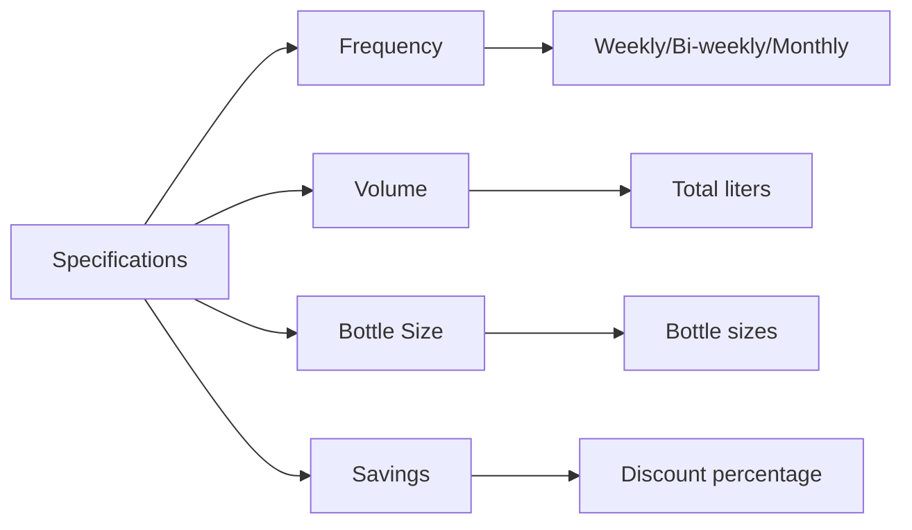

# Subscription Card Page Enhancement Plan

## Objective
Create a subscription card page with the same design quality as the product page, while maintaining subscription-specific functionality.

## Current Limitations
1. Simpler layout compared to product page
2. Missing specifications grid section
3. No related products section
4. Inconsistent styling (shadows, rounded corners)

## Proposed Changes

### 1. Layout Structure
- Adopt the product page's two-column layout (60/40 split)
- Add container with shadow and rounded corners
- Match padding and spacing values

### 2. Specifications Section


### 3. Styling Improvements
- Add `shadow-sm` and `rounded-xl` classes
- Match typography (font sizes, weights)
- Consistent blue color scheme
- Same button styling (padding, hover effects)

### 4. Related Subscriptions
- Reuse RelatedProducts component
- Filter to show only subscription products
- Update query to fetch related subscriptions

### 5. Component Structure
```typescript
interface SubscriptionDetailsProps {
  subscription: SubscriptionProduct;
  relatedSubscriptions: SubscriptionProduct[];
}

function SubscriptionDetails({
  subscription,
  relatedSubscriptions
}: SubscriptionDetailsProps) {
  // Reuse ProductDetails layout with subscription-specific fields
}
```

## Implementation Steps

1. Create new `SubscriptionDetails` component based on `ProductDetails`
2. Update specifications section for subscription fields
3. Add related subscriptions section
4. Modify styling to match product page
5. Update route handler to fetch related subscriptions
6. Ensure cart functionality works with subscriptions

## Files to Modify
1. `src/app/[lang]/bottled-drinking-water-delivery-subscription/[slug]/page.tsx`
2. New: `src/components/subscriptions/SubscriptionDetails.tsx`
3. `src/lib/products.ts` (add subscription query methods)
4. `src/types/products.ts` (ensure type safety)